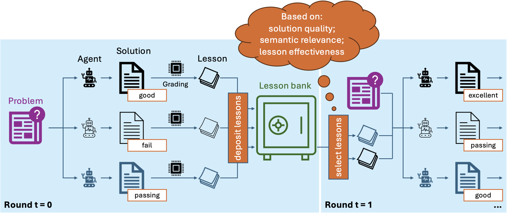

# Lessons Learned: A Multi-Agent Framework for Code LLMs to Learn and Improve

This is the official repository for the NeurIPS 2025 paper "[Lessons Learned: A Multi-Agent Framework for Code LLMs to Learn and Improve](https://arxiv.org/pdf/2505.23946)."

## Introduction

**LessonL** is a lesson-based framework for multiple LLM agents to collaboratively solve coding problems by learning from each other.

<div align="center">

<details>
  <summary>Abstract</summary>
  <p align="left">
  Recent studies show that LLMs possess different skills and specialize in different tasks. In fact, we observe that their varied performance occur in several levels of granularity. For example, in the code optimization task, code LLMs excel at different optimization categories and no one dominates others. This observation prompts the question of how one leverages multiple LLM agents to solve a coding problem without knowing their complementary strengths a priori. We argue that a team of agents can learn from each other's successes and failures so as to improve their own performance. Thus, a lesson is the knowledge produced by an agent and passed on to other agents in the collective solution process. We propose a lesson-based collaboration framework, design the lesson solicitation--banking--selection mechanism, and demonstrate that a team of small LLMs with lessons learned can outperform a much larger LLM and other multi-LLM collaboration methods.
  </p>
</details>



</div>

## Tasks

**LessonL** is primarily developed for code optimization, but it is a general framework that could be used for other coding tasks, such as code generation. The implementation for code optimization is located in the `code-opt` folder, while that for code generation can be found in the `code-gen` folder.

For code optimization, the folder also includes the modified benchmarks **ParEval** and **PolyBench** used in the paper.

### Code Optimization

Check [README.md](code-opt/README.md) in the `code-opt` folder.

### Code Generation

Check [README.md](code-gen/README.md) in the `code-gen` folder.

## Citing LessonL
Please cite the paper and star this repo if you use **LessonL** or find it helpful. Free feel to contact liuy72@rpi.edu or open an issue if you have any questions.

```
@INPROCEEDINGS{liu2025lessons,
  TITLE={Lessons Learned: A Multi-Agent Framework for Code {LLMs} to Learn and Improve},
  AUTHOR={Liu, Yuanzhe and Deng, Ryan and Kaler, Tim and Chen, Xuhao and Leiserson, Charles E and Ma, Yao and Chen, Jie},
  BOOKTITLE={Advances in Neural Information Processing Systems 38},
  YEAR={2025},
}
```
